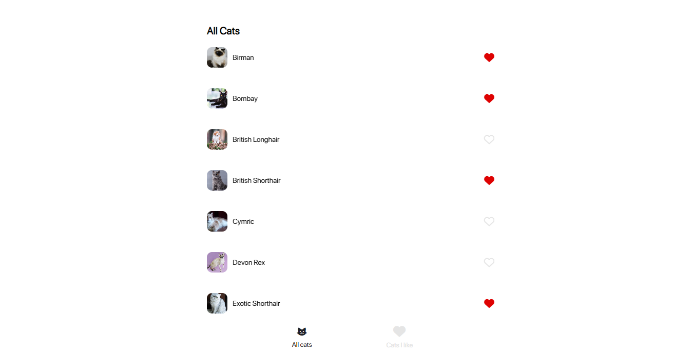
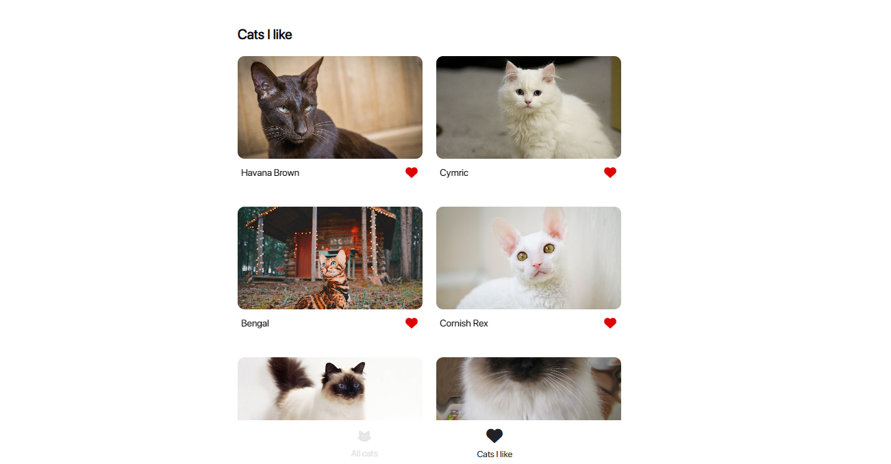

# Backdrop test app

This is a react native app built with Expo; my submission for Backdrop's react native coding challenge.



## Installation

Install packages with npm.

```bash
npm install
```

Start android/web/IOS app

```bash
npm run [ios/android/web]
```

## Run test suites

Tests are implemented with jest, jest-expo and react-test-renderer

```bash
npm run test
```

## Contributing

Pull requests are welcome. For major changes, please open an issue first to discuss what you would like to change.

Please make sure to update tests as appropriate.

## License

[MIT](https://choosealicense.com/licenses/mit/)
